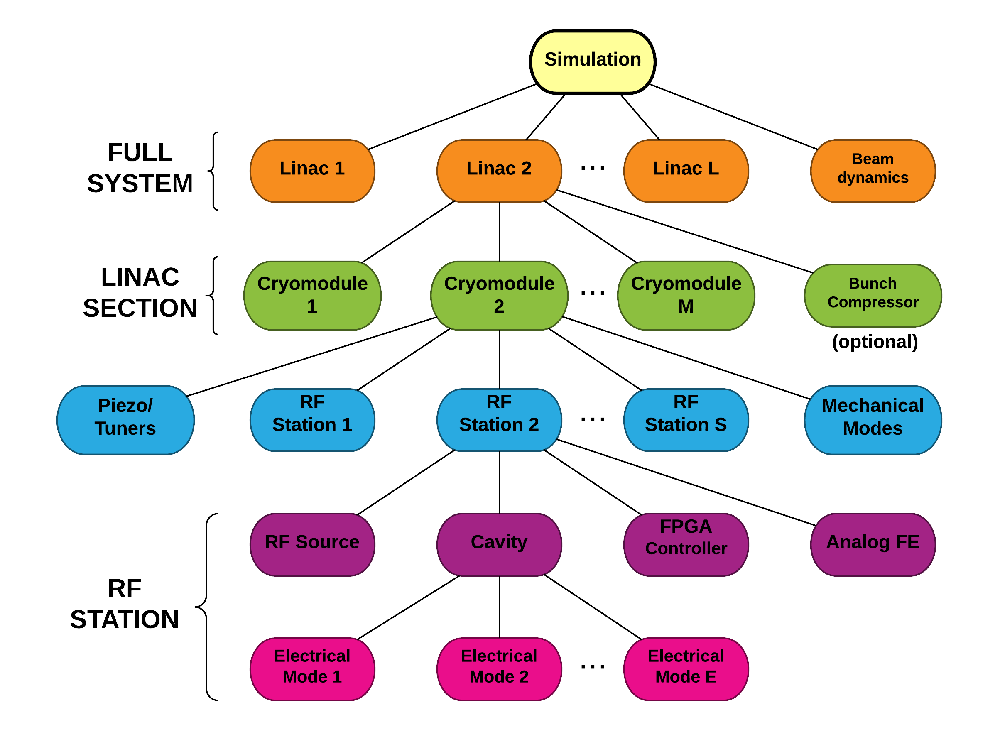

# Accelerator System Simulation Engine

## Overview

This code base includes elements to run time-series simulations of an entire accelerator.
The description of the Physics involved, along with general considerations on the capabilities of the models as well as details on the hierarchy can be found in the `doc/reports/physics/` directory. To generate a PDF version of that document, type:

		$ make physics_model.pdf

The code base (`source/` directory) has three components to it:

* Back-end physics simulator (in C),

	Each element shown in the model hierarchy of the Physics document has a C file associated with it, where the mathematical equations are implemented.
* Top-level code to configure and run simulations (in Python),

	The main Python program (used to interface with a User interface) is in `source/main.py`.
	The Python code used to configure the models is in `source/readjson`, which translates long JSON configuration files into a hierarchical structure of Python objects. The idea behind this setup is that it is easy to find tools to easily generate JSON files, including user-friendly online tools.

* Logic to glue C with Python (SWIG).

	The C and the Python code is well partitioned and one should be able to develop them independently, Makefiles handle the magic of generating SWIG wrappers for the Python to interact with the C back-end. SWIG is also useful if someone prefers a language other than Python to run the models.

## Dependencies

* Python 2.7
* Numpy, Scipy, Matplotlib - Python packages. The code was developed with the following versions:

		In [1]: import numpy, scipy, matplotlib
		In [2]: numpy.__version__
		Out[2]: '1.8.2'
		In [3]: scipy.__version__
		Out[3]: '0.13.3'
		In [4]: matplotlib.__version__
		Out[4]: '1.3.1'

* SWIG:

The version used for development:

		$ swig -version
		SWIG Version 3.0.5
		Compiled with g++ [x86_64-unknown-linux-gnu]
		Configured options: +pcre

This version has also been tested to work:

		$ swig -version
		SWIG Version 2.0.7
		Compiled with g++ [x86_64-unknown-linux-gnu]
		Configured options: +pcre

If you are running on Mac OS X and install SWIG, you need to change the SWIG linking rule (unfortunately it is platform dependent). Go to `source/rules.mk` and edit as indicated in the comments.

* [Oct2py](https://pypi.python.org/pypi/oct2py): Python to GNU Octave bridge --> run m-files from Python for some unit tests.
* Octave:

		$ octave --version
		GNU Octave, version 3.8.1

* Pydot - Python wrapper of Graphviz, used for generating images of connectivities.
* Doxygen - Automatic code documentation

		$ doxygen --version
		1.8.6

## Unit tests

A series of unit tests have been designed for two purposes:

* Provide means for proper development by testing every component of this complicated system independently,

* Illustrate usage:

	All unit tests are written in Python. For a component `X.c` in the back-end code, there is a `X_test.py` program that will parse some JSON configuration for the test and exercise its functionality. Unit tests produce plots (which are all shown and documented in the Physics document), and in some cases they will even return a PASS/FAIL boolean and print out some test results to standard output.

To run all the unit tests sequentially, type (from the top directory):

		$ make unit_tests.log

Once you type that command, a plot will pop on the screen. Close it in order to run the next test and generate a new plot. Once the full test is completed, you can examine the `unit_tests.log` file for some test results. If everything went well, you should see this at the end of the file:

		ooooo ALL TESTS PASSED ooooo

## Documentation

### Physics

Full documentation on the Physics involved in this model, along with general information on the model hierarchy and capabilities can be found in the `doc` directory. As indicated above, to produce the Physics document in PDF form type:

 		$ make physics_model.pdf

 You can also find presentations in the form of Impress.js websites and LaTeX in the `doc/presentations` directory. For the web presentations, open the index.html files on your browser and navigate using the mouse and keyboard arrows.

 ### Code base

 The code base is fully commented and automatically-generated documentation using Doxygen is available in two forms:

 * HTML

To generate type (from the top level directory):

		$ make doxygen

That command with create a directory called `_doxygen/` in the top directory, and will actually generate the documentation in both HTML and LaTeX formats.
To access the HTML documentation open the `_doxygen/html/index.html` file on your browser.

* PDF (from a LaTeX file)

To generate type (from the top level directory):

		$ make code_map.pdf

This command will make a copy of the PDF available in the top level directory.

To clean up the directory from all files generated by the Makefiles, type:

		$ make clean

## Public Domain Notice

This material was prepared as an account of work sponsored by an agency of the United States Government. Neither the United States Government nor the United States Department of Energy, nor the Contractor, nor any or their employees, nor any jurisdiction or organization that has cooperated in the development of these materials, **makes any warranty, express or implied, or assumes any legal liability or responsibility for the accuracy, completeness, or usefulness or any information, apparatus, product, software, or process disclosed, or represents that its use would not infringe privately owned rights**.

Reference herein to any specific commercial product, process, or service by trade name, trademark, manufacturer, or otherwise does not necessarily constitute or imply its endorsement, recommendation, or favoring by the United States Government or any agency thereof, or The Regents of the University of California. The views and opinions of authors expressed herein do not necessarily state or reflect those of the United States Government or any agency thereof.

\* Redistributions of the software in any form, and publications based on work performed using the
software should include the following citation as a reference:

Doolittle, Lawrence R., and Carlos P. Serrano. 2016. Global Feedback Simulator (Berkeley Lab case 2016-013). Lawrence Berkeley National Laboratory. http://gitlab.lbl.gov/modeling/system-feedback-stability.

LAWRENCE BERKELEY NATIONAL LABORATORY *operated by* The Regents of the University of California *for the* UNITED STATES DEPARTMENT OF ENERGY *under Contract No. DE-AC02-05CH11231*.

## Acknowledgments

Many people have contributed to this work in one way or another over the years. A lot of the Physics came from Larry Doolittle (LBNL) and Paul Emma (SLAC), and many students helped in the different stages of the development, especially Alejandro Queiruga and Daniel Driver from U.C. Berkeley in the initial translation of our legacy Octave/Matlab code into C. Other people who greatly helped include John Byrd and Gang Huang from LBNL, Claudio Rivetta (SLAC), Quim Llimona from Universitat Pompeu Fabra in Barcelona, Zeyad Zaky and Bhavesh Patel from U.C. Berkeley and Marvin Munoz and Jack Olivieri (once interns at LBNL).
